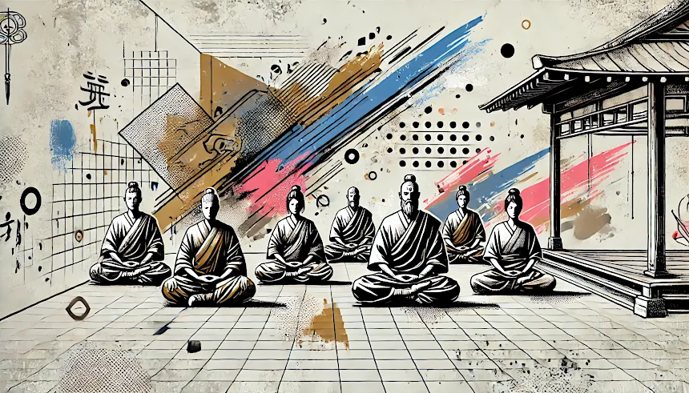

Maître Kosen, moine zen depuis 1971, dirige le dojo zen de Montpellier. Il fut l’un des plus proches disciples de Maître Taisen Deshimaru, auprès duquel il pratiqua durant quinze ans. En 1984, il reçoit le Shiho (transmission du Dharma) des mains de Maître Niwa Zenji, plus haute autorité du Zen au Japon, devenant ainsi maître dans la tradition du zen. Il transmet ensuite le Shiho à plusieurs de ses disciples, dont [Françoise Jomon Julien](https://zen-deshimaru-dijon.com/meditation-zen-a-dijon-francoise-jomon-julien/).

Après avoir suivi l'enseignement de Maître Deshimaru durant de longues années, Maître Kosen a ouvert un dojo à Rennes, puis à Amsterdam, avant de s'installer à Montpellier où il dirige aujourd’hui le [dojo zen de Montpellier](https://www.zen-montpellier.fr/).

Le dojo zen de Montpellier est un centre majeur de diffusion du zen en France. Il s’agit d’un lieu authentique et traditionnel, dirigé par Maître Kosen, héritier de la transmission des patriarches. Certains des attributs de Maître Deshimaru y sont conservés, témoignant de la continuité de la tradition.

Ce dojo unique accueille quotidiennement des nonnes et des moines zen, proches disciples de Maître Kosen. Leur présence offre aux débutants, aux pratiquants réguliers et aux visiteurs une opportunité précieuse de s’immerger dans la pratique du bouddhisme zen aux côtés de personnes profondément enracinées dans cette tradition.

En plus des nombreuses séances de méditation hebdomadaires, des initiations et des journées ou matinées de zazen, le dojo de Montpellier entretient des liens forts avec le temple zen Yujo Nyusanji, situé à 1 h 30 de Montpellier, dans le parc régional du Caroux.

Le site du dojo de Montpellier diffuse régulièrement les kusens de Maître Kosen sous forme de podcast et vous permettent de pratiquer zazen chez vous, si vous ne pouvez venir au dojo, en profitant d'un enseignement vivifiant. Tenez-vous également informés des matinées de zazen organisées par le dojo, c'est l'occasion unique de pratiquer avec l'un des plus grands disciples de Maître Deshimaru.
