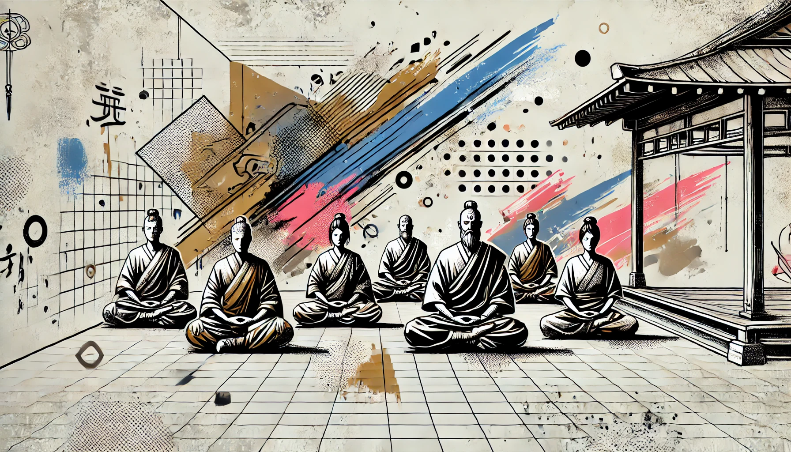

S'asseoir dans la posture juste est une expérience vivante du corps et de l'esprit. Assis face au mur sur un zafu (coussin rond), les jambes dans la position du lotus ou demi-lotus, les genoux posés sur le sol, le dos bien droit, la nuque étirée, la main gauche sur la main droite, le tranchant des mains contre le bas du ventre.

Dans une immobilité totale, on se concentre plus spécialement sur l'expiration. L'[esprit conscient](https://zen-montpellier.fr/podcast/zen-et-sophrologie-posture-et-cerveau/) est au repos. Sans entretenir ni rejeter les pensées, on les laisse passer tout en se concentrant sur la posture et la respiration.

> Être [zen](https://zen-deshimaru-dijon.com/le-zen/), c'est savoir faire le silence à l'intérieur de soi et découvrir ainsi notre vraie dimension qui apparaît alors, comme si les mots l'avaient rendue captive.

<iframe title="YouTube video player" src="https://www.youtube.com/embed/aubOncTjcjA?si=zLUyY9pqYqLqMwg7" width="560" height="315" frameborder="0" allowfullscreen="allowfullscreen"></iframe>
